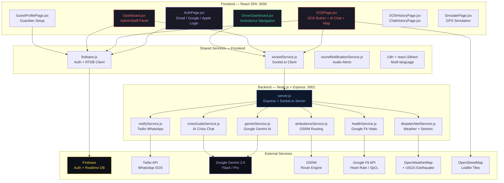
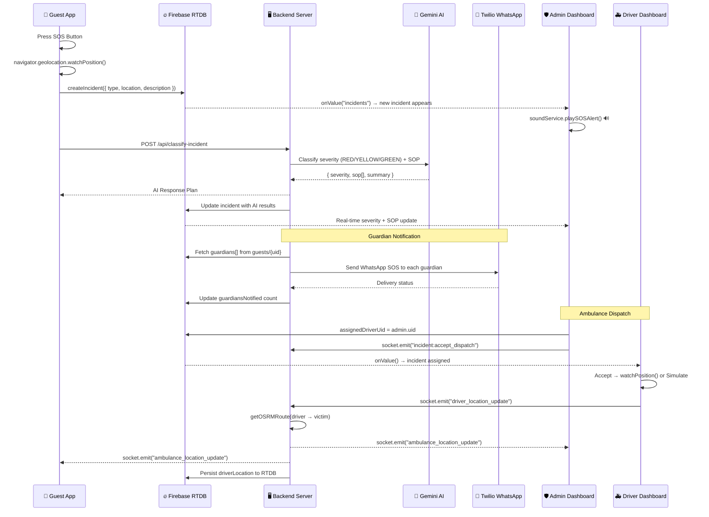
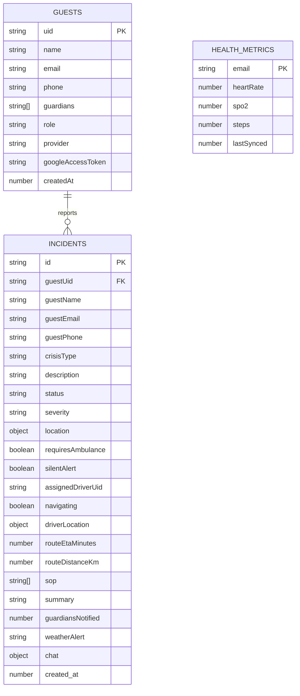
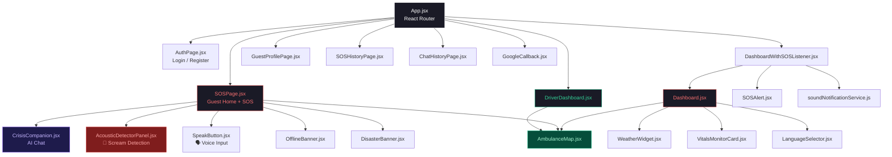

# RespondAI — Technical Flow & System Architecture

## 1. High-Level System Architecture



---

## 2. SOS Alert Flow (End-to-End)



---

## 3. Live Ambulance Tracking Flow

```mermaid
flowchart LR
    subgraph "Driver Device"
        GPS["watchPosition()<br/>enableHighAccuracy: true<br/>maximumAge: 0"]
        EMIT["emitDriverLocation()<br/>{ incidentId, lat, lng,<br/>victimLat, victimLng }"]
    end

    subgraph "Backend Server"
        RECV["socket.on<br/>driver_location_update"]
        ROUTE["getOSRMRoute()<br/>OSRM API Call"]
        CACHE["driverLocations[id]<br/>In-Memory Cache"]
        BROADCAST["io.to(room).emit<br/>ambulance_location_update"]
        PERSIST["Firebase RTDB<br/>incidents/{id}/driverLocation"]
    end

    subgraph "Admin Dashboard"
        ADMIN_SOCKET["onAmbulanceLocationChanged()"]
        ADMIN_MAP["AmbulanceMap.jsx<br/>Leaflet Marker + Polyline"]
    end

    subgraph "Guest SOS Page"
        GUEST_SOCKET["onAmbulanceLocationChanged()"]
        GUEST_FB["listenToIncident() fallback"]
        GUEST_MAP["AmbulanceMap.jsx<br/>Ambulance Marker + ETA"]
    end

    GPS -->|every ~3s| EMIT
    EMIT -->|Socket.io| RECV
    RECV --> ROUTE
    ROUTE --> CACHE
    CACHE --> BROADCAST
    RECV --> PERSIST
    BROADCAST -->|room: incident_{id}| ADMIN_SOCKET
    BROADCAST -->|room: incident_{id}| GUEST_SOCKET
    PERSIST -->|onValue listener| GUEST_FB
    ADMIN_SOCKET --> ADMIN_MAP
    GUEST_SOCKET --> GUEST_MAP
    GUEST_FB --> GUEST_MAP

    style GPS fill:#064e3b,stroke:#10B981,color:#A7F3D0
    style ROUTE fill:#1e1b4b,stroke:#8B5CF6,color:#C4B5FD
    style BROADCAST fill:#7f1d1d,stroke:#E24B4A,color:#FCA5A5
    style PERSIST fill:#78350f,stroke:#F59E0B,color:#FCD34D
```

---

## 4. Firebase Realtime Database Schema



---

## 5. Component Dependency Map



---

## 6. Technology Stack Summary

| Layer | Technology | Purpose |
|---|---|---|
| **Frontend Framework** | React 18 + Create React App | SPA with component-based architecture |
| **Routing** | React Router v6 | Client-side page navigation |
| **State Management** | React useState/useEffect + Firebase onValue | Real-time reactive state |
| **Styling** | Inline styles + CSS Modules + Framer Motion | Dark glassmorphic UI with animations |
| **Maps** | Leaflet + react-leaflet + OpenStreetMap | Interactive map tiles and markers |
| **Internationalization** | react-i18next | Multi-language support (EN, HI, MR, etc.) |
| **Backend Runtime** | Node.js + Express | REST API server |
| **Real-time Transport** | Socket.io (WebSocket + polling fallback) | Live ambulance tracking & event broadcasting |
| **Database** | Firebase Realtime Database | NoSQL JSON tree — incidents, guests, health |
| **Authentication** | Firebase Auth (Email, Google, Apple) | Multi-provider user authentication |
| **AI / Classification** | Google Gemini 2.0 Flash | Incident severity classification + SOP generation |
| **AI Chat** | Google Gemini Pro | Crisis companion conversational AI |
| **Notifications** | Twilio WhatsApp API (Sandbox) | Guardian SOS alerts via WhatsApp |
| **Routing Engine** | OSRM (Open Source Routing Machine) | Driving distance, ETA, and polyline calculation |
| **Health Monitoring** | Google Fit REST API | Heart rate, SpO₂, step count telemetry |
| **Weather / Disaster** | OpenWeatherMap + USGS Earthquake API | Severe weather alerts + seismic monitoring |
| **Audio Detection** | Web Audio API (AudioWorklet) | Real-time scream/explosion detection |
| **Voice Input** | Web Speech API (SpeechRecognition) | Hands-free SOS via voice command |
| **PWA / Offline** | Service Worker + Background Sync | Offline SOS queuing and network resilience |

---

## 7. API Endpoints

| Method | Route | Handler | Description |
|---|---|---|---|
| `POST` | `/api/classify-incident` | `geminiService.classifyIncident` | AI severity classification + SOP |
| `POST` | `/api/crisis-guide` | `crisisGuideService.chatCrisisGuide` | AI crisis companion chat |
| `GET` | `/api/disaster-alerts` | `disasterAlertService.getNearbyAlerts` | Weather + earthquake alerts |
| `GET` | `/api/ambulance/driver-location/:id` | In-memory cache lookup | Cached driver GPS position |
| `POST` | `/api/health/sync` | `healthService.upsertMetrics` | Sync Google Fit vitals |
| `GET` | `/api/health/:email` | `healthService.getLatestMetrics` | Fetch latest health metrics |
| `POST` | `/api/health/force-sync` | `healthService` | Force re-fetch from Google Fit |

## 8. Socket.io Events

| Event Name | Direction | Payload | Description |
|---|---|---|---|
| `join_incident_room` | Client → Server | `{ incidentId }` | Join a room for incident updates |
| `driver:online` | Client → Server | `{ driverId }` | Register driver as available |
| `incident:accept_dispatch` | Client → Server | `{ incidentId, userId }` | Accept ambulance dispatch |
| `driver:start_navigation` | Client → Server | `{ incidentId, driverId }` | Signal navigation has started |
| `driver_location_update` | Client → Server | `{ incidentId, lat, lng, victimLat, victimLng }` | Stream driver GPS |
| `ambulance_location_update` | Server → Client | `{ incidentId, driverLocation, routeData }` | Broadcast ambulance position + route |
| `navigation_started` | Server → Client | `{ incidentId, driverId, startedAt }` | Notify all that navigation began |
| `join_health_stream` | Client → Server | `{ email }` | Subscribe to health vitals updates |
| `health:updated` | Server → Client | `{ heartRate, spo2, steps }` | Real-time vitals push |
